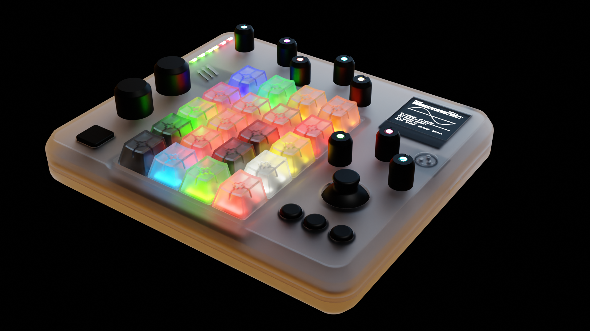

> **Work in progress - this README is being written.**

# SevenSynthCore

*Custom hardware . Custom DSP engine*

A from-scratch polyphonic synthesizer running on bare metal.
Custom audio engine, modular signal graph, a 128×128 OLED UI,
and a surprisingly large palette of weird sounds.

---

## Sound engine

The DSP engine is entirely custom.
Audio-rate modulation, multipole filters, FM operators, ensemble chorusing,
algorithmic reverb, all running on a microcontroller the size of a stick of gum.
The goal is not to sound conventional.

| Type | Description |
|------|-------------|
| **Rack** | Dynamic signal graph. Oscillators, filters, effects and modulation chained freely. Mono, paraphonic and polyphonic modes. |
| **Six-Op FM** | DX7-style operator engine. Patch editor on a 128×128 display, because why not. |
| **Ensemble** | Up to 32 voices. Detuned oscillator pairs, key-tracked LP, three-tap ensemble chorus on the bus. |
| **Sampler** *(coming)* | TF-card playback with dynamic pre-caching. Resampling and resampling-based sound design in the works. |

<!--  -->
<!--  -->

---

## Under the hood

Every part of the stack was written for this machine.
No framework, no RTOS audio task abstraction, no compromise on determinism.

- **Desktop simulator**: the full engine and UI runs in a desktop window. What you hear is what you get.
- **RGB key feedback**: 36 RGB LEDs across the key matrix. Piano-style note colours, held-note highlight, sequencer state and more to come.
- **OLED UI**: full patch editor, sequencer, FX rack, and key-layout editor on a 128×128 display. Tab navigation, real-time parameter control.

<!--  -->

---

## Hardware

Original hardware, designed and built from scratch.

| | |
|---|---|
| MCU | ESP32-S3, 240 MHz |
| Audio DAC | PCM5102APWR |
| Amplifier | LM4871 |
| Controls | CD4067 16-channel analog mux (pots / knobs) |
| Key matrix | 8x5 |
| Key LEDs | 36 RGB |
| Display | 128x128 OLED |
| Storage | TF card |
| Power | 2S/3S Li-ion battery · IP2326 charger |
| Open hardware | Schematics + 3D files, coming soon |

<!--  -->
<!--  -->

> **Hardware v2 in progress** - better performance, better controls, details coming.

---

## Roadmap

- [x] Custom modular rack engine
- [x] FM (six-op) + Strings synth types with dx7 presets
- [x] RGB key LEDs + OLED UI
- [ ] Sampler engine - TF-card playback
- [ ] Resampling workflow - record, mangle, and re-pitch any sound the synth makes
- [ ] Hardware v2 - v1 schematics and 3D files releasing alongside it

---

## Build & run

The desktop simulator builds with MSYS2/UCRT64 and SDL2 on Windows, or with standard GCC/Clang on Linux.
Firmware targets PlatformIO.
Full setup guide in [DEVELOPING.md](DEVELOPING.md).

<!--  -->

---

*SevenSynthCore · by sevenist*
